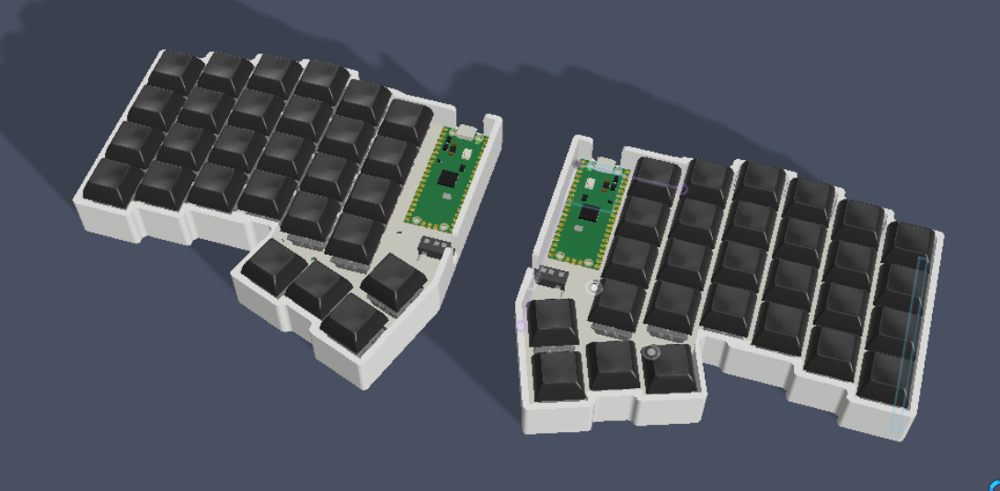
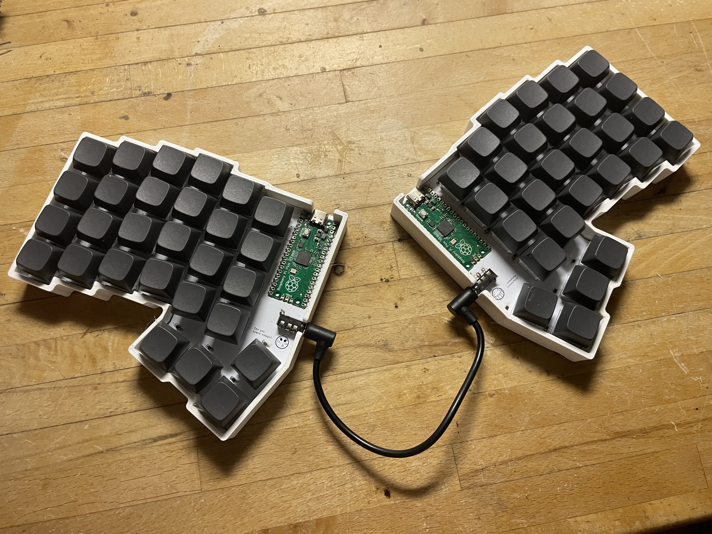
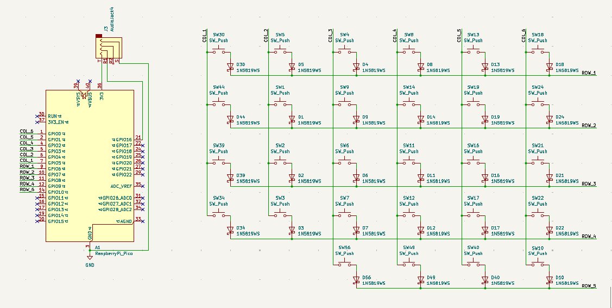
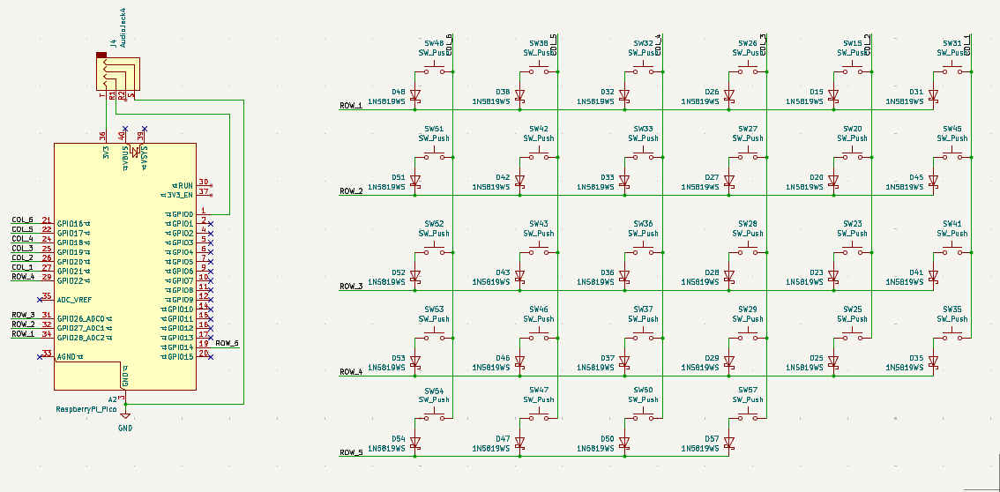
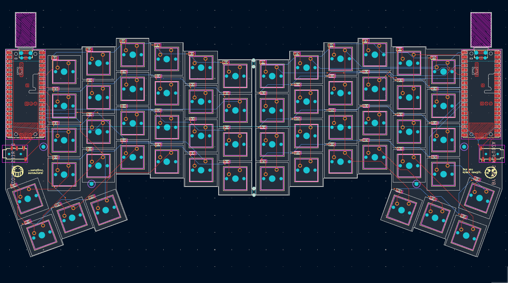
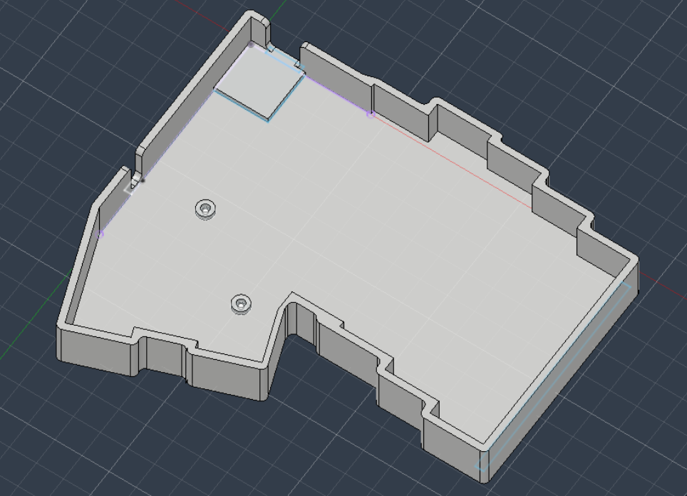

# JETT
<b> A wired 56 key split keyboard powered by RP2040 microcontrollers.
</b>

3D render:

Final build:

After creating the GOATPad i decided to take up a slightly more challenging twist to that project. This time a full split keyboard, which taught me how to panelize PCBs and make two MCU's communicate together.

  ### Specs
- Raspberry Pico microcontroller
- 56 keys
- MX Brown switches
- USB Type-C connectivity
- 3D Printed Case

## Schematic
### Left
 

### Right

## PCB

## Case

## Bill of Materials

|Name                               |Purpose                          |Quantity|Total Cost (USD)|Link                                                                                                                                        |Distributor|
|-----------------------------------|---------------------------------|--------|----------------|--------------------|-----------|
|M2 Heat inserts                    |Screw holes in case              |1       |1.95            |https://www.aliexpress.com/item/1005007640664497.html?mp=1&pdp_ext_f=%7B%22cart2PdpParams%22%3A%7B%22pdpBusinessMode%22%3A%22retail%22%7D%7D|Aliexpress |
|M2 Screws                          |Mounting PCB to case             |1       |1.35            |https://www.aliexpress.com/item/4000026780118.html?mp=1&pdp_ext_f=%7B%22cart2PdpParams%22%3A%7B%22pdpBusinessMode%22%3A%22retail%22%7D%7D   |Aliexpress |
|3.5mm PJ-320D audio jack (10PCS)   |Port for TRRS cable              |        |1.20            |https://www.aliexpress.com/item/4000661908135.html                                                                                          |Aliexpress |
|1N5819WS SOD-323 Diodes (100PCS)   |Diodes for key matrix            |        |1.64            |https://www.aliexpress.com/item/1005006216984245.html                                                                                       |Aliexpress |
|Male-to-Male TRRS cable            |For MCU's to share power and data|1       |2.50            |https://www.aliexpress.com/item/1005008288720867.html                                                                                       |Aliexpress |
|Black XDA Profile keycaps (64PCS)  |Key caps                         |        |15.06           |https://www.aliexpress.com/item/1005011932744770.html?mp=1                                                                                  |Aliexpress |
|MX style Brown key switches (80PCS)|Key switches                     |        |6.91            |https://www.aliexpress.com/item/1005011838889689.html                                                                                       |Aliexpress |
|Raspberry Pico                     |Microcontroller                  |2       |4.55            |https://www.aliexpress.com/item/1005005617180169.html                                                                                       |Aliexpress |
|PCB                                |Keyboard PCB                     |5       |22.90           |                                                                                                                                            |JLCPCB     |
|  | TOTAL |  | 58.06 |  |  |

*Not including shipping and tax

